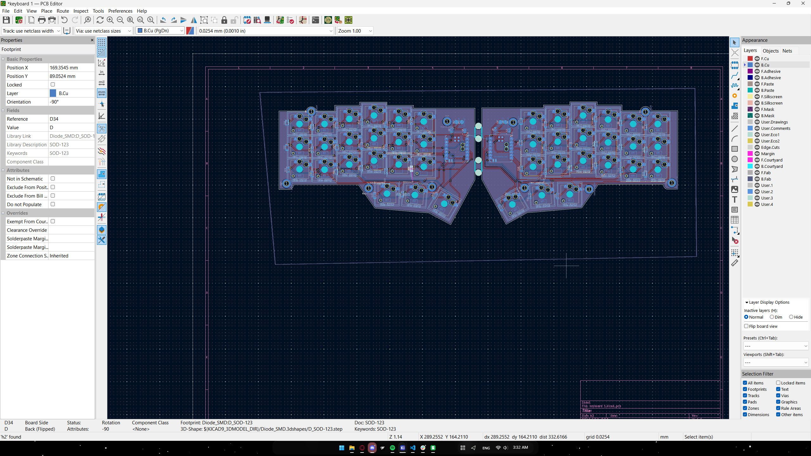

helloooooooooooooooooooooo, if you are reading this then you are at the readme section of this repo, so pretty am i right? i know, i know. 
anyways, for anyone who is suprisingly interested in my project here are the key components of the build as well as my key take aways from my first project and some inspo for this.
    first of all, the microcontrollers im using are a pair of seeed xiao nRF52840s, the normal ones will do just fine.
    the pcb was designed on kicad with the libraries from the hackclub stasis event starter project (the split keyboard one) and is manufactured via jlcpcb
    my switches are the kailh choc v2 deep sea silent whale brown switches, due to their tactile yet silent profile.
    for the batteries i havent decided on a li-po battery size for now
    both the case and keycaps ill design after i get the pcb in hand for refernce and ideas 
Now, as for my mistakes, there are afew:
  1) its best to split the work into chunks and finish them consistently. you dont have to do evrything immidiatly, but try to do related tasks back to back to avoid forgetting where you are at in the build process
  2) try to simply your models in the pcb editor as much as possible. this is because services like jlcpcb change the shipping and manufacturing costs drastically depending on the size of the pcb, but also stuff like the number of layers on your pcb or the pating and stuff
  3) thats it for now
my key inspo for this project was the corne layout for split keyboards and the typeractive corn pcb aluminum case for the pcb design
 

here is the step file of the pcb if you decide to make a custom case for it:

here is the BOM :

<pre>
Name	                                                        Purpose	                             Qty	Total (USD)	                     Link	                 Distributor	

Seeed Studio XIAO nRF52840 (XIAO BLE)	             they are the microcontrollers	                  2	    $19.80	          <a href="https://www.aliexpress.com/item/1005005184230104.html?spm=a2g0o.productlist.main.1.6249IJXxIJXxPH&algo_pvid=938eadd9-71ba-4352-88da-76219ebfed72&algo_exp_id=938eadd9-71ba-4352-88da-76219ebfed72-0&pdp_ext_f=%7B%22order%22%3A%2216%22%2C%22eval%22%3A%221%22%2C%22fromPage%22%3A%22search%22%7D&pdp_npi=6%40dis%21EUR%212.25%210.86%21%21%2117.66%216.76%21%402103894417762777976955069ec2d7%2112000032017018112%21sea%21GR%216010249690%21ABX%211%210%21n_tag%3A-29910%3Bd%3A8b9bcfc7%3Bm03_new_user%3A-29895%3BpisId%3A5000000203610259&curPageLogUid=4cgpcI0GnRlD&utparam-url=scene%3Asearch%7Cquery_from%3A%7Cx_object_id%3A1005005184230104%7C_p_origin_prod%3A">link</a>     seeed studio	

0805 806k resistors	                                       for part of vbat	                        100	    $1.68	          <a href="URL_HERE">link</a>    aliexpress	

0805 2M resistors	                                        for the bt pin	                        100	    $2.18	          <a href="URL_HERE">link</a> 

    
1N4148W T4 SOD-123 diodes	                       needed for the keyboard matrix	                100	    $1.84	          <a href="URL_HERE">link</a>	  aliexpress	

kailh choc v2 hotswap sockets	                the are the hotswap sockets for my keyswitches	     50	    $5.81	          <a href="URL_HERE">link</a>	  aliexpress	

kailh choc v2 deep sea silent mini whale brown	          they are the keyswitches	                 50	   $12.97	          <a href="URL_HERE">link</a>  aliexpress	

the pcb	                                                         its the pcb	                      5	   $15.80	          <a href="URL_HERE">link</a>	  jlcpcb	
</pre>
